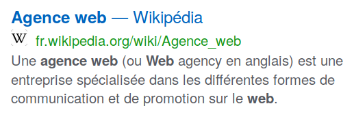
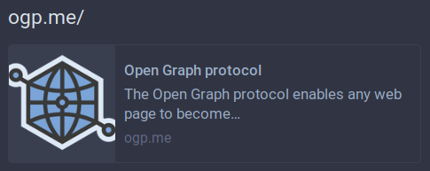
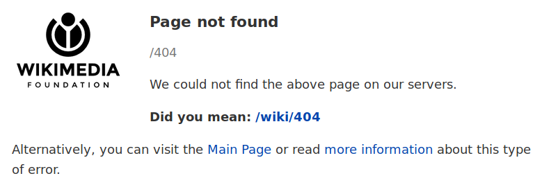
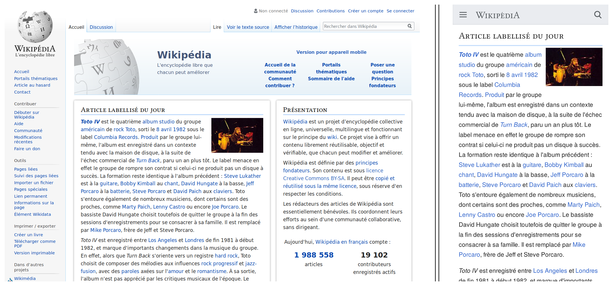

+++
title = "Le référencement naturel"
+++

# Le référencement naturel

*Publié le 28 juillet 2016 et mis à jour le 23 octobre 2022 sous licence CC BY-SA 4.0, par Yannick A.*

## Qu'est-ce que le référencement naturel ?

À l'origine, le référencement naturel, c'est la capacité qu'a un site à se faire
référencer par d'autres sites, de façon « naturelle », c'est-à-dire par des
robots indexateurs, par des humains qui partagent des liens vers le site, etc.
Aujourd'hui, le sens a quelque peu évolué et consiste notamment à faire
ressortir pour le mieux un site sur les moteurs de recherche (on parle aussi
d'indexation et de positionnement).

Le terme « naturel » peut induire en erreur, car l'existence du seul site ne
suffit pas à ce qu'il se retrouve bien positionné. En effet, pour cela, il faut
bien travailler le balisage (le code), le contenu, le design, la rapidité, et
bien d'autres choses. En fait, le terme « naturel » s'oppose ici à « payant »,
pour le référencement payant, qui consiste à payer pour faire apparaitre en
publicité/annonce son site sur les moteurs de recherche ou sites partenaires.

Le référencement naturel est un domaine très vaste, et, par conséquent, il est
difficile d'aborder tous les points. Cependant, j'essaye de présenter au mieux
l'ensemble du domaine dans les grandes lignes.

Ici ne sont présentées que des généralités et des bonnes pratiques, et non des
règles absolues, d'autant plus qu'elles peuvent évoluer. Il faut traiter chaque
site et chaque page au cas par cas.

Il est à noter que, contrairement à une idée répandue, le référencement naturel
évolue assez lentement. En fait, ce qui peut donner cette impression d'évolution
rapide, c'est que les moteurs de recherche sont de plus en plus stricts à cause
des abus qu'il y a eu (et qu'il y a encore) : page satellite, abus de mots-clés,
site lent à charger, contenu dupliqué, balisage incorrect, etc. En somme, il
s'agit de revenir à ce qui aurait toujours dû être fait : un site rapide, bien
balisé, du contenu écrit pour l'utilisateur et non pour le moteur de recherche,
limiter les liens morts, etc.

Le référencement naturel est improprement nommé « Search Engine Optimization »
(SEO) en anglais, laissant penser qu'il faut optimiser son site pour les
moteurs de recherche, alors qu'en réalité il faut l'optimiser pour les
utilisateurs, ce qui aura pour conséquence de l'optimiser pour les moteurs de
recherche. Ce que cherchent les moteurs de recherche, ce sont les contenus qui
répondent au mieux aux demandes des utilisateurs. Un travail spécifique pour
les moteurs de recherche est bien sûr à effectuer, mais ce n'est pas la tâche
principale. Après tout, ce que l'on cherche à faire, c'est écrire du contenu
qui sera lu par un humain et non par un robot.

Google étant le moteur de recherche le plus répandu, c'est sur sa façon
d'analyser les pages que nous allons nous concentrer. Cependant, les
recommandations présentées ici sont bonnes à la fois pour les visiteurs, pour
Google et pour les autres moteurs de recherche
([DuckDuckGo](https://duckduckgo.com/), [Brave
Search](https://search.brave.com/), [Qwant](https://www.qwant.com/), etc., que
je recommande par ailleurs).

Petite note : on parle de *référencement* ou *d'indexation* pour indiquer
qu'une page est connue par le moteur de recherche, et de *positionnement* pour
la position dans les résultats de recherche du moteur de recherche (l'idéal
étant la première place dans toutes les recherches).

*Commençons.*

<!-- @todo À sourcer -->

## Réfléchir aux mots-clés des pages

Chaque page est référencée selon les mots qui se trouvent dedans, les mots
principaux étant appelés mots-clés.

Les mots-clés peuvent être séparés en trois catégories :

- **Le mot-clé principal**, qui sera le sujet de la page ;
- **Les mots-clés secondaires**, des mots et expressions en rapport avec le
  thème, ou des synonymes ;
- **Les mots-clés lexicaux**, qui sont des mots et expressions qui peuvent
  s'associer au thème.

Pour *chaque page* du site, il faut réfléchir à ces mots-clés.

Par exemple, pour une agence web, sur une page qui présente ses activités :

- **Mot-clé principal :** agence web ;
- **Mots-clés secondaires :** création site web, conception site internet,
  réalisation projet web...
- **Mots-clés lexicaux :** développement, hébergement, commerce en ligne, site
  statique...

Il est inutile de réfléchir aux déclinaisons d'un même mot (sans accent, au
pluriel, au masculin/féminin, etc.), les moteurs de recherche n'en font pas une
grande différence. Aussi, si vous souhaitez ensuite utiliser un mot-clé dans
une de vos pages, les articles — et d'autres mots, appelés *stopwords* — sont,
eux aussi, ignorés, ainsi vous pouvez écrire en français « création de sites
web », le mot-clé ici reste bien « création site web » pour les moteurs de
recherche.

Les mots-clés que vous choisissez sont une trame de travail. Vous pourrez les
utiliser dans le titre de la page, la description et le contenu. Aussi, en
écrivant, il se peut que des mots-clés auxquels vous n'aviez pas pensé
initialement ressortent.

<!-- @todo Parler du volume des mots-clés, de comment choisir ses mots-clés et
de la longue traine. cf. <https://optimiz.me/guide-complet-du-referencement/>.
-->

Source : [Comment choisir ses mots-clés pour le référencement ? –
Optimiz.me](https://optimiz.me/choix-des-mots-cles-pour-le-referencement/).

## Titre de la page

La balise titre (`<title>`) est très importante, aussi bien pour les internautes
que pour les moteurs de recherche, car c'est elle qui indique le contenu qui se
trouve dans la page. Pour les internautes, ce titre est affiché sur le moteur de
recherche comme étant le nom du résultat et aussi comme le nom de l'onglet dans
le navigateur. Pour les moteurs de recherche, cela permet de mieux répondre aux
requêtes des internautes. En cela, le titre doit être concis et descriptif et
est donc un élément important à travailler pour avoir un bon référencement et un
bon positionnement.

La longueur maximale recommandée pour le titre est de 60 à 70 caractères. Cela
varie d'un titre à l'autre (cela dépend en effet de la taille des caractères
qui composent le titre, un ‹ i › n'a pas la même largeur qu'un ‹ a › par
exemple). La longueur maximale recommandée est donc d'environ 65 caractères. Si
le titre dépasse cette largeur, ce n'est pas grave, il sera tronqué à
l'affichage sur le moteur de recherche. Il faut donc (essayer de) faire en
sorte que les termes importants se trouvent dans la limite de la longueur
maximale recommandée, afin de s'assurer qu'ils sont bien visibles et non
tronqués.

La règle générale pour former le titre d'une page est la suivante :

- **Page d'accueil :** « Nom du site – Brève description du site ou de l'activité » ;
- **Pages internes :** « Nom de la page – Nom du site ».

Bien sûr, cela peut varier, mais c'est la tendance générale. Elle permet de
ressortir en gras (sur les moteurs de recherche) les mots-clés tapés par
l'internaute.

<figure>
  

  <figcaption>
    Mise en gras de la recherche « agence web » sur un résultat du moteur de
    recherche Qwant.
  </figcaption>
</figure>

Comme séparateur, vous êtes libre d'utiliser ce qui vous convient : ‹ | ›,
‹ - ›, ‹ — ›, etc.

Une autre règle est qu'aucune page ne doit (ou ne devrait) avoir le même titre
qu'une autre, car le titre indique le contenu de la page. Si plusieurs pages ont
le même titre, cela signifie sûrement qu'elles devraient être rassemblées en une
seule page ou que les pages sont mal nommées. Cette règle permet de ne pas
perdre l'utilisateur dans la structure du site et améliore le positionnement des
pages.

Source : [Title Tag – Moz](https://moz.com/learn/seo/title-tag).

<!-- @todo Apporter d'autres sources -->

## Description de la page

<!-- @todo Bien faire comprendre que la description n'est pas un critère fort
de positionnement, qu'elle sert principalement à attirer l'œil de l'intenaute
-->

La balise méta-description (`<meta name="description" content="[...]" />`) sert
à l'internaute, car elle est fréquemment affichée sous le titre de la page dans
les moteurs de recherche. Pour les moteurs de recherche, cela permet d'en
savoir un peu plus sur le contenu de la page afin de mieux la référencer. À
noter que parfois, ce ne sera pas cette description qui sera affichée dans les
résultats du moteur de recherche, mais un contenu extrait de la page, si
celui-ci juge cela plus pertinent (par exemple dans le cas où la recherche de
l'internaute ne se trouve pas dans la méta-description de la page mais dans son
contenu).

La longueur optimale de la méta-description est de 150 à 160 caractères. Si la
longueur dépasse, l'affichage sera tronqué. Il est par ailleurs inutile de
rédiger une description trop longue, car 1) elle n'est pas toujours affichée
2) son affichage sera tronqué 3) le moteur de recherche s'intéresse plutôt au
contenu.

La description ne doit pas être là pour contenir (que) des mots-clés, elle doit
surtout servir à attirer l'œil, à indiquer quel est le contenu que
l'utilisateur va retrouver sur cette page ; elle sert à compléter le titre.

Comme pour le titre, la description devrait aussi être différente pour chaque
page.

Sources :

- [Meta Description Tag – Moz](https://moz.com/learn/seo/meta-description).

<!-- @todo Apporter d'autres sources -->

## Contenu de la page

Le contenu de la page est l'un des facteurs les plus importants. C'est ici que
se présente le contenu le plus intéressant pour l'utilisateur et donc pour les
moteurs de recherche. Regardons les points importants pour un bon contenu.

### Un contenu intéressant et pertinent

Écrire une page, ce n'est pas (que) pour le référencement, c'est avant tout pour
le lecteur : celle-ci doit être intéressante (apprendre des choses) et
pertinente (en rapport avec le site et avec la recherche effectuée par
l'internaute s'il vient d'un moteur de recherche).

Lors de la rédaction, il faut avant tout rédiger en essayant de penser au sujet
et en oubliant un instant les mots-clés. Ensuite, à la relecture, en plus de
corriger les fautes d'orthographe, d'inattention et autres, il faut essayer de
voir s'il n'est pas possible de placer, le plus naturellement possible, des
mots-clés qui ne vous serez pas venus à l'esprit à la première écriture. Par la
suite, il ne faut pas hésiter à se relire plusieurs fois, jusqu'à que vous
jugiez que le contenu écrit soit du contenu que vous jugez intéressant pour
l'utilisateur, qu'il soit intéressant et qu'il soit pertinent.

Sur ce point, diverses mauvaises pratiques existent, et qu'il est préférable
d'éviter :

- La rédaction de courts articles de blog ne servant qu'à alimenter le site,
  afin d'augmenter son référencement et son positionnement sur les moteurs de
  recherche, sans réel intérêt d'apprendre quelque chose au lecteur. Cela pollue
  les résultats du moteur de recherche, ce qui peut être agaçant pour un
  internaute ;
- L'ajout d'une description aux catégories ou aux produits d'un site de commerce
  en ligne, dans le seul but d'y placer des mots-clés ;
- Les contenus publicitaires/sponsorisés sans valeur ajoutée (sans parler du
  manque de neutralité de point de vue).
- Et probablement bien d'autres.

### Une répétition faible

En essayant de placer des mots-clés, il se peut qu'il y ait de trop nombreuses
répétitions, cela n'est bon ni pour l'utilisateur (le texte devient lourd à
lire), ni pour les moteurs de recherche, qui peuvent y voir là une tentative
d'optimisation d'un mot-clé et vous pénaliser. N'hésitez donc pas à utiliser des
synonymes, des mots proches, etc. Cependant, si une répétition est inévitable,
il vaut parfois mieux laisser en l'état.

### Un contenu assez long

Plus la page a du contenu, plus elle a de mots-clés, mieux elle ressort sur les
moteurs de recherche. La taille recommandée pour le contenu est d'au moins 200
mots. En deçà, le contenu risque d'être mal référencé. Cependant, si vous
n'arrivez pas à atteindre ce nombre de mots pour une page, il est inutile
d'écrire du contenu si celui-ci n'apporte rien à l'internaute.

N'hésitez à habiller un peu la page avec quelques images, cela permet d'aérer le
contenu et améliore le confort de l'utilisateur dans sa lecture. De plus, si
l'image illustre vos propos, cela améliore sa compréhension.

Attention cependant, si une page contient trop de sujets différents, et donc
trop de mots-clés différents, cela peut nuire au référencement (le moteur de
recherche ayant du mal à déterminer le sujet / les mots-clés principaux). Pour
l'internaute, cela peut aussi être source de confusion. Dans ce cas, il est
préférable, si possible, de découper la page en plusieurs pages.

### Éviter le contenu dupliqué

Aucun contenu ne doit être accessible par deux URL différentes ; voici des
exemples d'URL différentes :

- HTTP/HTTPS : `http://...` et `https://...` ;
- www/rien : `www.site.fr` et `site.fr` ;
- Chemin : `site.fr/ma-page` et `site.fr/mon-contenu` ;
- Extension : `site.fr` et `site.com` ;
- Sites différents : `monsite.fr` et `austresite.fr`.

Dans le cas d'une redirection, le contenu n'est pas considéré comme dupliqué
puisqu'une page A qui redirige vers une page B, seule la page B affiche le
contenu (le « contenu » de la page A étant la redirection vers B). Ainsi, une
page HTTP qui redirige vers une page HTTPS ne crée pas de duplication de
contenu.

Dans le cas d'une reprise de contenu depuis un autre site (en ayant les droits),
il faut bien penser indiquer la source (avec le lien vers celle-ci).

Par la même occasion, il faut éviter que deux pages ne soient trop similaires,
cela peut aussi être considéré comme un contenu dupliqué par les moteurs de
recherche.

Source : [Contenu en double – Google
Developers](https://developers.google.com/search/docs/advanced/guidelines/duplicate-content).

### Soigner la mise en forme

Une bonne mise en forme est agréable à la fois à l'utilisateur et au moteur de
recherche.

Par exemple, il faut éviter de placer tous les mots-clés que l'on juge
importants en gras car cela a deux effets de bords négatifs :

- Cela « pollue » le rendu du texte, ce qui rend la lecture plus difficile ;
- Avec trop de mots en gras, le moteur de recherche peut ne plus déterminer
  correctement les termes réellement importants, et donc baisser le
  positionnement sur certains mots-clés pourtant importants.

Cela vaut aussi pour l'italique.

<!-- @todo Apporter d'autres sources -->

## Architecture des titres

La page doit contenir des titres `<hn>` où `n` est le niveau de 1 à 6.

Typiquement, sur une page, il n'y a qu'un seul `<h1>`. Cependant, contrairement
à une idée répandue, il est possible d'en mettre plusieurs sans problème, tant
que le document est bien structuré. Par exemple pour une page qui liste des
articles avec le titre et le résumé, on peut imaginer un `<h1>` par titre.
Néanmoins, la plupart du temps, un seul titre `<h1>` suffit.

Ensuite si possible, il faut essayer de ne pas faire de saut dans les niveaux
des titres, de ne pas passer d'un titre `n` (ex. 2) à un titre `n+2` (ex. 4).

Une façon de voir si la page est bien architecturée est de ne conserver que les
titres et leur niveau, et de voir si cela forme un plan de page cohérent (telle
une table des matières).

On considère que :

- Le titre `<h1>` représente le titre de la page (il peut différer de la balise
  `<title>`) ;
- Les titres `<h2>` représentent les sections de la page ;
- Les titres `<h3>` représentent les sous-sections de la page ;
- Les titres `<h4>`, `<h5>` et `<h6>` servent à la mise en forme.

En cela, pour le référencement naturel, ce sont les titres `<h1>`, `<h2>` et
`<h3>` qui importent.

<!-- @todo Indiquer des sources -->

## Images

Lorsque vous placez des images sur votre site, il y a quelques contraintes à
respecter :

- **Toujours renseigner l'attribut `alt`** pour décrire les images avec du
  contenu (utile pour les moteurs de recherche et les personnes avec des
  déficiences visuelles). Pour les images d'illustration, qui n'apportent pas
  quelque chose à la compréhension du contenu, il faut tout de même renseigner
  l'attribut `alt`, avec une valeur vide, car sinon c'est l'URL de l'image qui
  est considérée comme étant le texte alternatif ;
- **L'image doit être fournie dans la taille affichée.** Dans le cas de
  l'affichage d'une image de 100 × 100 pixels, il faut fournir une image de
  cette taille, pas une image d'une taille plus grande, redimensionnée par HTML
  ou CSS, cela évite le chargement de données inutiles (et il ne faut pas
  fournir une image plus petite non plus, l'affichage serait pixelisé) ;
- **Légères**. Compressées le plus possible ;
- **Nommées.** Il peut être pertinent de nommer son image en rapport avec son
  contenu (`logo-blanc.png` est plus parlant que `f4b56e.png`).

<!-- Si possible, mettez une légende à l'image pour l'associer à quelque chose
de concret. -->

Il ne faut pas hésiter à aérer un contenu avec des images. Les images doivent
apporter, au mieux, une valeur à la page : illustration, dessin humoristique,
etc.

Les images ainsi placées sur un site peuvent ressortir sur les moteurs de
recherche d'images, et même aider, parfois directement, parfois indirectement,
à améliorer le positionnement du site sur les moteurs de recherche classiques.

Sources :

- [Bien utiliser l'attribut alt – La
  Cascade](https://la-cascade.io/bien-utiliser-lattribut-alt/) ;
- [Des images accessibles –
  Openweb.eu.org](https://openweb.eu.org/articles/accessibilite_images).

## Format de l'URL

Les URL d'un site doivent être « propres », c'est-à-dire qu'elles doivent
indiquer clairement le contenu associé. Par exemple
`site.fr/guide-referencement-naturel` est une URL propre tandis que
`site.fr/?page=42` ne l'est pas.

Source : [URL et Référencement naturel –
SeoMix](https://www.seomix.fr/url-referencement-naturel/).

## Fichier robots.txt

Le fichier `robots.txt`, que l'on place à la racine du site, sert à bloquer
l'accès à certaines pages aux robots qui passent sur un site, notamment aux
robots d'indexation qui référencent les sites. Cela permet par exemple
d'empêcher un robot de référencer des pages inutiles comme la page de connexion
à l'administration, un moteur de recherche interne, etc.

Cela ne constitue pas une sécurité, le robot d'indexation pouvant très bien
ignorer ce fichier. De plus, n'importe qui (n'importe quel humain) peut aller
voir ce fichier.

Il faut donc de faire attention à ne pas placer toutes les pages de son site ou
des pages importantes dans ce fichier, car certaines pages pourraient ne pas
être référencées à cause de cela.

Source : [Manuel d'implémentation – Robots.txt](http://robots-txt.com/).

## Fichier sitemap

Le fichier sitemap (`sitemap.xml`) n'est pas un fichier obligatoire. Il est
*plus ou moins* utile dans trois cas :

- **Un site volumineux**, pour s'assurer que le robot explorateur ait
  connaissance de toutes les pages ;
- **Un nouveau site**, pour que celui-ci soir indexé même si aucun autre ne
  pointe vers lui ;
- **Un site mal construit**, où certaines pages n'ont aucun lien vers elles.

Ce fichier, sur un site bien construit, n'a que très peu d'utilité car votre
site sera naturellement indexé et parcouru par les moteurs de recherche.

Si vous avez besoin de ce fichier pour que votre site soit correctement indexé
ou positionné, c'est que votre site est mal construit et qu'il est préférable
de le retravailler.

Source : [À propos des sitemaps – Google
Developers](https://developers.google.com/search/docs/advanced/sitemaps/overview).

## Un balisage correct

Le balisage permet de structurer son site et d'indiquer la nature d'un élément.
Par exemple `<header>` indique un entête, `
` un paragraphe, `<nav>` un menu,
etc.

Faire un cours ici serait bien trop long et peu pertinent, l'apprentissage du
HTML apprenant habituellement à structurer correctement ses pages.

Mais globalement, il faut bien vérifier que le code HTML est correctement
construit :

- Balisage correct (avec imbrication correcte) ;
- Pas d'utilisation de balises ou attributs qui n'existent pas ou qui sont
  obsolètes ;
- Éviter de surcharger le HTML de classes, d'ID, de style *inline*, de balises,
  etc. ;
- Renseigner le paramètre `lang` dans la balise `html` ;
- Préciser l'encodage `utf-8` ;
- Etc.

## Liens

**Note :** `follow` indique aux moteurs de recherche de suivre le lien, de voir
ce qui se trouve derrière, c'est le comportement par défaut de tous les liens.
`nofollow` indique aux moteurs de recherche de ne pas suivre le lien, ainsi un
lien vers un site peu recommandé, vers une page 404, etc. *ne devrait pas*
affecter le positionnement de votre site.

L'une des choses les plus importantes dans le référencement naturel, avec le
contenu, ce sont les liens vers votre page/votre site. Plus il y aura de liens
vers votre site, plus il sera visité et proposé par les moteurs de recherche.
Aussi, ces liens externes seront cliqués par les internautes.

Ces liens externes doivent apparaitre le plus spontanément possible : ce n'est
pas à vous de les créer ou de les acheter, c'est aux internautes de les faire,
de partager votre site sur un réseau social, un article de blog, un forum, un
commentaire, etc. Cela signifie que le contenu que vous avez rédigé plait.
Aussi, ces liens doivent être de qualité, si beaucoup de sites étrangers, de
téléchargement illégal, etc. pointent vers votre site, cela sera mal perçu par
les moteurs de recherche (cela est parfois utilisé par des concurrents pour
faire disparaitre leur concurrent des moteurs de recherche).

Vous pouvez bien sûr, en commentant un article de blog par exemple, mettre un
lien vers votre site qui sera placé sur votre pseudonyme/nom. Vous pouvez aussi
inscrire votre site sur un annuaire. Vous pouvez aussi proposer votre site sur
un forum, s'il répond au besoin exprimé. Mais, n'abusez pas de ces techniques.
Si vous le faites, soyez toujours naturel, répondez correctement au sujet et
évitez de poster de fausses informations (cela peut nuire à votre réputation).

Si vous payez pour publier des articles que vous avez écrits sur un autre site
que le vôtre, demandez à ce que l'article soit indiqué comme « publicitaire »
ou « sponsorisé », selon le cas (cela est obligé par la loi).

<!-- @todo À sourcer -->

### Liens internes

Lorsque vous faites des liens internes sur votre site, laissez-les toujours en
`follow` (en bref, ne mettez rien, car c'est le comportement par défaut).

Lorsque vous faites un lien, évitez le plus possible les libellés comme
« cliquez ici » ou autre, privilégiez un libellé explicatif, qui indique ce
vers quoi le lien amène, par exemple « en savoir plus sur le référencement
naturel ».

Sur votre site, n'hésitez pas à faire des liens internes (des liens entre vos
pages), sans jamais abuser, bien sûr.

<!-- @todo À sourcer -->

### Liens vers des sites externes

Pour les liens externes, s'ils sont en rapport avec votre activité et
pertinents, laissez-les en `follow`, sinon mettez-les en `nofollow`.

Si ce sont des liens qui sont publiés par les utilisateurs de votre site (par
exemple dans un espace commentaires), mettez-les en `nofollow`.

N'hésitez pas à agrémenter votre contenu de sources externes (que ce soit des
sites, des livres, des documentaires, etc.), cela vous donne une crédibilité et
le lecteur a la possibilité d'en savoir plus sur ce que vous énoncez.

<!-- @todo À sourcer -->

### Liens de partage

Les partages sur les réseaux sociaux créent des liens vers votre page, ce qui
peut améliorer le référencement du site et son nombre de visites.

Si vous placez des boutons de partage sur votre site, faites en sorte de ne pas
utiliser des scripts de partage mais de simples liens. En effet, ces scripts
chargent la plupart du temps trop de données et ralentissent le chargement de
votre page (ce qui nuit au positionnement). De plus, ces scripts sont
généralement intrusifs et font appel à des sites externes, violant la vie
privée de vos utilisateurs.

De plus, il a été démontré que l'[utilité de ces boutons était
limitée](https://wpmarmite.com/boutons-partage/), il est donc inutile d'en
mettre partout.

## Mise en forme du contenu

Il ne s'agit pas là vraiment du référencement naturel, mais plutôt de quelque
chose qui a effet dessus.

Un site bien mis en forme attirera davantage à lire votre contenu et à le
partager qu'un site mal mis en forme. Et ce partage a pour conséquence un
meilleur référencement.

Une bonne mise en forme passe par :

- Des paragraphes assez court ;
- Une structuration avec des titres ;
- Une largeur de contenu textuel assez faible (pour éviter au lecteur de devoir
  bouger l'œil de droite à gauche de manière brusque) ;
- Une police bien lisible (pas trop épaisse ni trop fine par exemple) ;
- Une taille de police raisonnable (pas trop petite ou trop grande) ;
- Et de bien d'autres éléments, comme la couleur, la mise en forme, les images,
  etc.

Aussi, il est intéressant d'essayer d'éviter de trop agresser l'utilisateur. Il
n'est pas rare aujourd'hui d'avoir de nombreuses barres ou fenêtres modales :

- Barre d'acceptation des *cookies* ;
- Formulaire d'inscription à la lettre d'information ;
- Bouton pour discuter *(chat)* ;
- Barre de téléchargement de l'application mobile ;
- Demande d'acceptation des notifications ;
- Affichage de la note d'un service d'avis ;
- Autres *popups* diverses ;
- Etc.

Tout cela peut bloquer ou gêner l'internaute dans sa navigation et est donc à
éviter au maximum ; d'autant plus que pour certains, cela ralentit même le
chargement du site.

<!-- @todo À sourcer -->

## Microdonnées

Les microdonnées s'ajoutent aux balises d'HTML. Elles permettent de définir
plus finement la structuration du contenu. Pour un article sur un site de
commerce en ligne par exemple, vous pouvez définir où est le prix, sa devise,
la note associée, son nom, sa description, s'il est en promotion, etc. Ces
données peuvent être utilisées par les moteurs de recherche soit pour répondre
plus spécifiquement aux requêtes, soit pour afficher directement la donnée.

- [schema.org](https://schema.org/).

<!-- @todo À sourcer -->

## Métadonnées

Le [protocole Open Graph](https://ogp.me/) définit des métadonnées qu'il est
possible de placer dans le code de son site afin que lorsque le lien est
partagé sur un réseau social, ou un salon de discussion en ligne, une « carte »
s'affiche avec les métadonnées renseignées (généralement, le titre de la page,
une courte description et une image le cas échéant).

<!--

<figure>
  

  <figcaption>
    Affiche des métadonnées <a href="https://ogp.me/">Open Graph</a> de
    l'article sur <a href="https://matomo.org/">Matomo</a> de
    <a href="https://fr.wikipedia.org/wiki/Matomo_(logiciel)">Wikipédia</a> sur
    <a href="https://discordapp.com/">Discord</a>.
  </figcaption>
</figure>

-->

<figure>
  

  <figcaption>
    Les métadonnées Open Graph du site Open Graph affichées sur l'instance
    <a href="https://mamot.fr/">Mamot</a> du réseau social
    <a href="https://joinmastodon.org/">Mastodon</a>.
  </figcaption>
</figure>

<!-- @todo À sourcer -->

## Commentaires

Si possible, activez les commentaires sur les articles de votre site. Cela
permet de créer des discussions.

Le premier avantage des commentaires, c'est que les lecteurs pourront corriger
certaines de vos fautes, qu'elles soient orthographiques, syntaxiques ou
carrément un paragraphe erroné à cause d'une mauvaise source.

Le second avantage, c'est qu'il rajoute du contenu votre page, donc un meilleur
référencement, les commentaires ayant habituellement un rapport avec le sujet. À
noter que cela n'est vrai que dans le cas où le système de commentaires est
intégré au site (c'est-à-dire que ce n'est pas une *iframe* ; Disqus (ou
similaire) à proscrire pour cet usage).

S'il y a des liens qui sont postés mais que vous craignez que ceux-ci
n'existent plus dans quelques années (liens morts) ou qu'ils soient de mauvaise
qualité, vous pouvez leur ajouter un attribut `rel="external nofollow"`.

Cependant, un système de commentaire peut être compliqué à gérer, car il faut
développer ou installer un module anti-spam pour prévenir des messages
inutiles, des messages frauduleux, des messages en masse, des messages
d'incitation à la haine, etc. Il faut aussi trouver un juste milieu dans le
filtre des commentaires, car la censure n'est jamais bonne. Une solution est de
laisser tous les commentaires, positifs comme négatifs, tant que ceux-ci ne
sont pas des spams comme décrits précédemment et qu'ils ne contiennent pas de
vocabulaire vulgaire/insultant. Aussi, traiter les commentaires peut demander
un temps considérable. Ainsi, si vous n'avez pas les moyens de vous occuper de
cela, il vaut peut-être mieux l'éviter.

<!-- @todo À sourcer -->

## Avis

Si votre site propose de poster des avis sur vos produits ou services, faites
en sorte que cette partie soit honnête :

- Ne postez pas vous-même des avis ;
- Ne payez personne pour poster des avis factices ;
- Ne censurez pas les avis négatifs ;
- Ne supprimez que les avis contenant des propos insultants ou obscènes.

Il est important de respecter cela, car autrement, il est difficile pour un
client de faire confiance aux avis qu'il lit et cela peut réduire vos ventes.
De plus, les faux avis sont interdits et punis par la loi.

<!-- @todo À sourcer -->

## Vitesse de chargement

Pour les internautes ainsi que pour les moteurs de recherche, le site doit se
charger rapidement. Pour Google, un site est considéré comme rapide avec un
temps de chargement inférieur à 1,5 seconde.

De plus, un site qui prend trop de temps à se charger vous fait perdre des
visiteurs et, dans le cas d'un site de commerce en ligne, des ventes.

Pour améliorer la vitesse de chargement du site il faut donc :

- Compresser les images (avec des outils comme
  [TinyPNG](https://tinypng.com/),
  [Imagine](https://github.com/meowtec/Imagine),
  [Compressor.io](https://compressor.io/),
  [Optimizilla](https://imagecompressor.com/fr/),
  [Trimage](https://trimage.org/),
  [Sqoosh](https://squoosh.app/),
  etc.) ;
- Minifier les scripts JavaScript ;
- Minifier le CSS ;
- Concaténer les fichiers JavaScript et CSS ;
- Éviter de faire de trop nombreuses requêtes ;
- Éviter de faire des requêtes vers des sites externes ;
- Activer la compression Gzip côté serveur ;
- Utiliser le cache client ;
- Mettre en cache des fichiers sur le serveur ;
- Etc.

Pour améliorer la vitesse du site, on agit donc principalement sur deux
facteurs : la réduction du poids du site (compression, minification...), et la
mise en cache des ressources.

De la même façon, il faut aussi optimiser la vitesse du site côté serveur. Là
aussi avec divers caches, des optimisation de calculs, la diminution de la
complexité du code, etc.

Quelques outils sont indiqués à la fin de cet article et permettent de mettre
en exergue certains défauts de votre site.

<!-- @todo À sourcer -->

## Erreurs 404

Dès que vous changez l'URL d'une page, une redirection de l'ancienne URL doit
être faite vers la nouvelle, pour avertir les moteurs de recherche du
changement d'URL et pour laisser les visiteurs qui connaissent l'adresse, y
accèdent par un marque-page, via leur historique ou un lien (interne ou
externe) non mis à jour, ne tombent sur une page d'erreur 404. Ensuite, il faut
faire au mieux pour que tous les liens internes redirigent vers la nouvelle
URL.

Lorsque vous supprimez une page, il faut vérifier que plus aucune page de votre
site ne pointe vers cette page.

Si une page est définitivement supprimée et qu'aucune nouvelle page ne la
remplace, vous pouvez laisser la page d'erreur 404. Aussi, faire une
redirection d'une page supprimée vers une autre page, qui n'est pas associée au
même contenu, ne sert à rien et ne fera que tromper les moteurs de recherche
(qui pourront vous pénaliser) et les internautes.

Aussi, vérifiez régulièrement que les liens que vous faites vers des sites
externes ne soient pas brisés. Si jamais un lien est brisé, il faut, selon le
cas, indiquer que le lien n'est plus accessible, trouver une source
alternative, supprimer le lien ou amener vers une archive encore en ligne.

<figure>
  

  <figcaption>
    La page d'erreur 404 de Wikipédia.
  </figcaption>
</figure>

Source : [Cool URIs don't change – W3C](https://www.w3.org/Provider/Style/URI).

## Fournir rapidement les informations pertinentes

Permettez à quiconque de trouver sur votre site, le plus rapidement, les
informations qu'il recherche.

Par exemple, si on recherche les informations d'une entreprise, association ou
autre, il faut un accès rapide à/aux :

- L'adresse de l'établissement (avec un plan, si possible) ;
- Numéro de téléphone ;
- Les horaires d'ouverture (complets, avec indications de l'ouverture durant
  les périodes de congés, les jours fériés, etc.).

Tout cela permet de rendre le site utile et donc de générer du trafic.

Il est aussi intéressant d'ajouter des boutons qui permettent d'aller
rapidement à l'action principale (réserver, commander, télécharger, etc.).

Cela passe par un bon design et une bonne architecture.

<!-- @todo À sourcer -->

## Accessibilité

Pour les personnes avec des déficiences visuelles, orthographiques, motrices ou
autre, il est nécessaire que le site soit « accessible », c'est-à-dire qu'il
soit utilisable sans difficulté par tout le monde.

Par exemple, pour les personnes avec une déficience visuelle (malvoyants et
aveugles), cela signifie qu'il faut que tout soit accessible sous forme de
texte, pour que les [lecteurs
d'écran](https://fr.wikipedia.org/wiki/Lecteur_d%27%C3%A9cran) puissent lire le
contenu :

- Il faut un attribut `alt` aux images ;
- Il ne faut pas utiliser d'image pour du contenu qui devrait être textuel. Par
  exemple, pour un évènement, il faut éviter de mettre l'image de l'affiche
  comme seul contenu, il faut un contenu textuel qui indique toutes les
  informations de l'affiche ;
- Faire une transcription textuelle des vidéos ;
- Etc.

Pour en savoir plus, vous pouvez faire un tour sur cette page :
[Affiches des règles à suivre pour une bonne
accessibilité](https://github.com/UKHomeOffice/posters/tree/master/accessibility/).

Cela a pour effet d'élargir l'audience du site et d'améliorer le référencement
naturel.

<!-- @todo À sourcer -->

## Retranscription des infographies et des vidéos

Quand vous publiez une infographie, essayez d'en faire une version textuelle
sous l'image. Cela permet :

1) D'être mieux référencé sur les moteurs de recherche (le texte peut être
lu) ;

2) Aux personnes avec des déficiences visuelles de pouvoir prendre connaissance
du contenu (soit en zoomant, soit avec un lecteur d'écran) ;

3) De permettre de copier/coller le contenu (pour par exemple le partager).

Cela vaut aussi pour les contenus vidéo, où il est préférable de faire une
retranscription textuelle (mêmes avantages que ci-dessus). Pour la vidéo, il
est même possible de faire des sous-titres. Intéressant par exemple pour
quelqu'un qui ne peut pas ou ne veut pas activer le son.

## Design adaptatif *(responsive design)*

Les moteurs de recherche, lors du référencement du site, prennent en compte la
possibilité de naviguer dessus depuis des appareils dont l'écran a une taille
réduite comme les tablettes et les téléphones. Cela vient du fait que les sites
sont visionnés depuis une large gamme d'appareils de très diverses tailles.

Pour cela, le site doit fonctionner aussi bien sur petit écran que sur grand
écran :

- Même vitesse de chargement ;
- Afficher le même contenu sur petit écran que sur grand écran ;
- Boutons et liens assez larges pour être appuyés ;
- Etc.

En bref, le site doit être adaptatif : il doit fonctionner pour toutes les
tailles d'écran et afficher le même contenu à chaque fois (seule la mise en
forme doit changer).

<figure>
  

  <figcaption>
    La page d'accueil de Wikipédia affichée sur un écran d'ordinateur et sur un
    téléphone portable.
  </figcaption>
</figure>

<!-- @todo À sourcer -->

## Âge et activité du site

Plus un site est ancien, mieux il est positionné, la durée d'existence du site
étant perçue comme un gage de qualité (aussi bien par les moteurs de recherche
que par les internautes).

Aussi, ne laissez pas votre site vivre de son côté : publiez des actualités,
complétez les descriptions de vos produits, améliorez l'interface utilisateur,
améliorez les titres et descriptions des pages, etc. Ainsi votre site sera
vivant et sera plus souvent mis à jour dans les moteurs de recherche, pour
ainsi être mieux positionné. Cela donne aux utilisateurs l'image d'un site
actif et le rend plus attractif.

<!-- @todo À sourcer -->

## HTTPS

Posséder un site en HTTPS est désormais une nécessité, à la fois pour les
moteurs de recherche, qui privilégient les sites HTTPS et pour les internautes
qui ont plus confiance en les sites HTTPS.

Posséder un site sécurisé permet donc d'être mieux positionné sur les moteurs
de recherche, à la fois naturellement (site privilégié) et à la fois par les
visites accrues dues à la confiance plus forte des internautes.

De plus, les prochaines mises à jour des navigateurs tendent à afficher les
sites HTTP comme non sécurisés, ce qui fera perdre bon nombre d'utilisateurs
aux sites qui n'utilisent pas HTTPS. Et les navigateurs affichent déjà les
formulaires avec des mots de passe comme non sécurisés sur les sites sans
HTTPS.

Posséder un site HTTPS est gratuit avec un outil comme
[Let's Encrypt](https://letsencrypt.org/). Cette alternative gratuite est tout
aussi sécurisée que les alternatives payantes, il n'y a donc aucune raison de
ne pas l'utiliser, excepté pour les
[certificats EV](https://en.wikipedia.org/wiki/Extended_Validation_Certificate)
qui n'offrent pas une plus grande protection, mais demande à l'organisme qui en
fait la demande de certifier son identité, réduisant le risque de l'usurpation
d'identité ; ces certificats sont surtout utilisés par les organismes
financiers ou très grosses structures, où le besoin d'être sûr de l'identité de
l'organisme est très fort.

<!-- @todo À sourcer -->

<!-- @todo Parler du référencement local : optimiser la visibilité du nom de la
ville, du département, des villes proches, etc. -->

## Mauvaises pratiques

Voici quelques mauvaises pratiques.

### Pages satellites

Une page satellite est une page créée uniquement pour le moteur de recherche.
Elle est prévue pour posséder les bons mots-clés et avoir une bonne
architecture, uniquement dans le but de ressortir sur les moteurs de recherche.
De plus, ces pages ne sont généralement pas facilement accessible depuis le
site, car le but visé par ces pages est uniquement de faire rentrer du trafic
via les moteurs de recherche.

Cela est mal vu par les moteurs de recherche, car il ne trouve pas, ou peu, de
liens vers la page sur le site (c'est comme cela qu'il sait qu'il s'agit d'une
page satellite).

Cela est aussi mauvais pour l'internaute, car s'il désire retrouver la page
depuis le site, celui-ci aura beaucoup de mal.

## Points n'affectant pas le positionnement

Voici une liste de quelques points qui n'affectent pas directement le
positionnement, alors qu'on pourrait penser que oui :

- L'affichage des notes n'influe pas directement le positionnement. Là où cela
  peut l'influer, c'est seulement indirectement, avec potentiellement un plus
  fort trafic si la note affichée est bonne et que de nombreuses personnes
  cliquent sur le lien. <!-- @todo À sourcer -->

## Résumé

En résumé, il faut :

- Faire en sorte que le site se charge rapidement ;
- Faire une belle mise en forme ;
- N'abuser de rien ;
- Écrire pour les lecteurs, pas pour les moteurs de recherche.

Il y aurait encore beaucoup à dire et à développer, mais cet article est mené à
évoluer, selon l'évolution des techniques de référencement naturel, des bonnes
pratiques, etc.

## Quelques sites et outils

Quelques sites et outils qui vous permettent d'analyser votre site internet
afin de l'améliorer, que ce soit au niveau du référencement, de la sécurité, de
l'accessibilité et bien plus.

### Sites

- [PageSpeed Insights](https://pagespeed.web.dev/), testez la vitesse de votre
  site sur ordinateur et mobile ;
- [web.dev Measure (Lighthouse)](https://web.dev/measure/), idem que PageSpeed
  Insights.
- [Dareboost](https://www.dareboost.com/), testez, analysez et optimisez votre
  site web sur le référencement, la sécurité, la qualité et plus encore ;
- [CryptCheck](https://cryptcheck.fr/), testez le niveau des certificats de
  votre site ;
- [webhint](https://webhint.io/).

### Outils

- [aXe Developer
  Tools](https://addons.mozilla.org/en-US/firefox/addon/axe-devtools/), outil
  de développement web pour vous donner des conseils d'accessibilité pour vos
  pages.

## Sources

Ces informations proviennent de mon expérience personnelle et professionnelle
(en tant que développeur web) à travers le temps, et souvent je n'ai pas
enregistré les sources. Pour certains points, j'ai néanmoins pu indiquer quelque
sources. Aussi, il ne faut jamais se baser sur une source unique, il faut
toujours les croiser et les confronter.

Voici quelques ressources plus génériques :

- [How Loading Time Affects Your Bottom
  Line](https://neilpatel.com/blog/loading-time/) ;
- [Pourquoi la performance web doit être une priorité ? 10 données
  marquantes](https://www.webmarketing-com.com/2014/07/09/28900-performance-web-etre-priorite-10-donnees-marquantes) ;
- [Qu'est-ce que le référencement
  (SEO) ?](https://www.axenet.fr/infographie-seo/) ;
- [Optimisation pour les moteurs de recherche –
  Wikipédia](https://fr.wikipedia.org/wiki/Optimisation_pour_les_moteurs_de_recherche).
- [FullStackOptimization](https://www.fullstackoptimization.com/)
