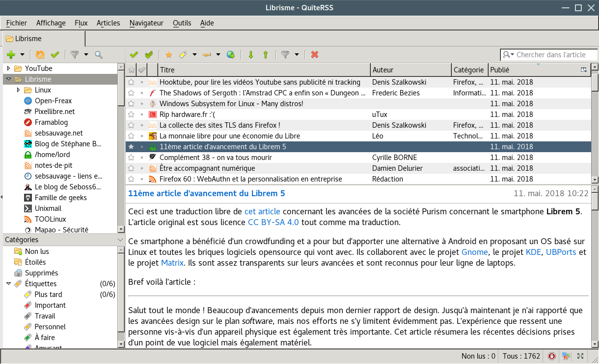

+++
title = "Présentation de RSS"
date = 2018-05-15
updated = 2018-09-21
short_description = "Pourquoi préférer RSS aux réseaux sociaux."
+++

Intéressons-nous à RSS, une technologie du tout début des années 2000 qui n'a
rien à envier aux réseaux sociaux pour suivre l'actualité (et même pour
d'autres choses, par exemple pour suivre des chaines YouTube).

## Qu'est-ce que RSS ?

RSS (« Really Simple Syndication ») est un format de données utilisé par les
sites internet, principalement pour rassembler dans un même fichier leurs
dernières actualités/leurs derniers articles.

Par exemple, le flux RSS (le nom donné au fichier présenté juste avant) de Next
INPact (un site d'actualité que j'aime bien) est accessible à l'adresse
suivante : <https://www.nextinpact.com/rss/news.xml>.

Libre à vous d'ouvrir le lien, mais vous y trouverez un contenu peu aguicheur,
et c'est normal. L'idée derrière le format RSS est d'utiliser un logiciel,
appelé agrégateur, qui chargera et affichera pour vous les contenus auxquels
vous êtes abonnés. Nous reviendrons sur cela par la suite.

Dans cet article, nous allons nous concentrer sur les avantages de RSS par
rapport aux réseaux sociaux. Sachez cependant, que les deux usages sont
différents et peuvent être complémentaires et que RSS convient aussi bien aux
utilisateurs des réseaux sociaux qu'à ceux qui ne les utilisent pas.

Commençons d'abord par regarder les avantages que présente RSS pour le
propriétaire d'un site et pour un internaute, par rapport aux réseaux sociaux.

<figure>
  

  <figcaption>
    Le logo de RSS, par
    <a href="https://pixabay.com/fr/rss-aliments-pour-animaux-ic%C3%B4ne-2440955/">joshborup</a>.
  </figcaption>
</figure>

## Quels sont les avantages de RSS pour le propriétaire d'un site par rapport aux réseaux sociaux ?

- **Information centralisée :** vous publiez un article sur votre site, le
  fichier RSS est mis à jour et... c'est tout. Tous les abonnés sont désormais
  notifiés du nouvel article sans que vous n'ayez eu besoin d'annoncer sa
  sortie sur quelconque réseau social ; <!-- En plus de permettre un gain de
  temps, cela permet, si votre site offre une plateforme pour les commentaires,
  de centraliser ceux-ci de manière à générer une seule discussion bien plus
  active que celle que vous auriez obtenue en divisant votre communauté sur
  divers réseaux sociaux -->

- **Gratuit :** une fois le système RSS mis en place sur votre site , il n'y a
  plus aucun coût (avec WordPress, par exemple, il est installé par défaut) ;

- **Tout le monde voit toutes vos publications :**

  - Toutes vos publications atterriront chez tous les abonnés à votre flux RSS
    (aucun algorithme ne décide de ce qui sera affiché chez vos abonnés,
    contrairement à Facebook et YouTube par exemple) ;

  - Il n'y pas de priorisation de contenu affiché comme sur Facebook ou Twitter
    par exemple : tous les contenus sont affichés comme égaux ;

  - Alors que sur les réseaux sociaux classiques, l'accès aux informations plus
    anciennes devient rapidement difficile, voire impossible pour les
    utilisateurs, les agrégateurs de flux RSS souffrent moins de ce problème.
    En effet, leurs utilisateurs peuvent trier leurs abonnements et ne voient
    que les titres des articles, qui sont clairement affichés comme lus ou
    non-lus ;

  - Sur un réseau social, vos publications sont mélangées aux messages des
    amis/contacts/abonnements de l'utilisateur, et celui-ci peut donc
    facilement rater votre publication. Avec RSS, le contenu n'étant que des
    articles de blog, d'actualité et autres, l'utilisateur est clairement là
    pour chercher de l'information et est donc plus à même de voir votre
    publication ;

- **Possibilité de proposer plusieurs flux :** avec RSS, il est possible de
  proposer plusieurs flux aux utilisateurs. Il est par exemple possible
  d'imaginer un flux qui notifie des actualités et un autre flux qui notifie
  des offres commerciales. Ainsi, les utilisateurs peuvent ne s'abonner qu'aux
  flux qui les intéressent ;

- **Complémentaire :** rien ne vous empêche de proposer RSS et de continuer à
  publier sur les réseaux sociaux. Avoir RSS est cependant un plus car il
  permet de proposer l'accès à vos contenus à plus de personnes (par exemple à
  ceux ne possédant pas de compte sur les réseaux sociaux).

## Quels sont les avantages de RSS par rapport aux réseaux sociaux pour un internaute ?

- **Information centralisée :** vous vous abonnez aux flux fournis par les
  sites internet, et le logiciel agrégateur que vous utilisez vous affiche tous
  les articles de tous les sites auxquels vous êtes abonnés. Il n'est pas
  nécessaire de posséder un compte Facebook, et un compte Twitter, et aller
  vérifier à la main chaque site qui ne met pas à jour sa page sur un réseau
  social ou n'en possède pas. Vous pouvez, par exemple, centraliser vos
  abonnements YouTube, à vos blog préférés et à vos sites d'actualité préférés
  au sein du même logiciel ;

- **Aucun abonnement forcé :** il est impossible pour un site ou une entreprise
  de vous abonner de force à un flux RSS comme cela se fait parfois pour les
  infolettres *(newsletters)*. Seul vous pouvez faire la démarche de vous
  abonner (et de vous désabonner) ;

- **Priorité au contenu :**

  - **Aucun filtre :** le contenu ne vous est pas filtré, aucun algorithme ne
    décide pour vous ce qui vous sera affiché/ce qui vous plaira (contrairement
    à Facebook ou YouTube par exemple). Vous verrez donc tout ce qui est publié
    par les sites internet auxquels vous êtes abonné, sans exception ;

  - **Aucune publicité :** l'interface qui liste vos flux n'affiche aucune
    publicité, seulement les articles (excepté certains agrégateurs de flux qui
    peuvent afficher de la publicité, s'il s'agit de leur modèle économique) ;

- **Accessible à tous :**

  - **Globalement déployé :** presque tous les sites ont un flux RSS, il n'y a
    pas besoin d'aller visiter chaque jour un site dont vous suivez les
    articles ou d'attendre que le site mette son compte Facebook ou Twitter à
    jour (quand bien même le site possède un compte sur ces réseaux sociaux) ;

  - **Multiplateforme :** cela fonctionne sur Windows, macOS, GNU/Linux,
    Android, iOS, etc. ;

  - **Gratuit :** l'accès aux flux RSS est gratuit. Et la plupart des
    agrégateurs de flux sont aussi gratuits ;

  - **RSS ne peut pas fermer :** contrairement à Facebook, Twitter ou autre
    réseau social, RSS ne peut pas fermer du jour au lendemain, car il n'y a
    pas de service, simplement un standard que les sites respectent ou non ;

  - **Pas besoin de posséder un compte :** tout se fait anonymement, aucune
    information n'est à partager, aucun compte n'est à créer (à l'exception de
    celui de l'agrégateur de flux si vous utilisez un agrégateur de flux en
    ligne) ;

- **Tri avancé :**

  - **Dossiers :** il est possible de créer des dossiers pour trier vos
    abonnements.  Vous pouvez ainsi par exemple placer vos abonnements YouTube
    dans un dossier, vos abonnements à des sites sur l'informatique dans un
    autre dossier et vos abonnements à des sites de cuisine sur un autre. Il
    aussi possible d'imbriquer les dossiers ;

  - **Étiquettes et favoris :** il est possible d'étiqueter des articles et de
    les mettre en favoris, pour les catégoriser, pour pouvoir les retrouver
    plus facilement, les marquer à relire plus tard, etc. ;

  - **Aucun mélange :** avec les réseaux sociaux, l'actualité, les articles de
    journaux et autres articles de blog sont mélangés avec vos conversations
    privées. Cela n'est pas le cas avec RSS ;

  - **Marquer comme lu/non lu :** il est possible, comme avec une messagerie,
    de marquer les articles comme étant lu ou non lu. Cela permet de savoir
    rapidement ce qui a été lu ou non ;

## Quelles utilisations sont possibles ?

En plus de permettre de suivre l'actualité de n'importe quel site, RSS peut
être utilisé pour :

- **Peut remplacer une infolettre non ciblée :** une infolettre est très proche
  d'un article. Il est donc possible, même si ce n'est pas le but premier de
  RSS, de l'utiliser comme une infolettre. Il n'est pas rare d'ailleurs que des
  infolettre soient publiés sous trois formats différents : par courriel, par
  un article sur le site et par un flux RSS. Pour cela, il suffit de publier
  l'infolettre sous forme d'article sur votre site, et toutes les personnes
  abonnées à votre flux RSS verront elles aussi l'article. Cela permet de
  rendre l'abonnement et le désabonnement très simple pour le lecteur,
  puisqu'il n'a aucune information à partager avec vous (c'est un plus dans le
  cadre du
  [RGPD](https://www.cnil.fr/fr/reglement-europeen-sur-la-protection-des-donnees-ce-qui-change-pour-les-professionnels)),
  aucun envoi par courrier électronique à gérer, aucune liste d'abonnements à
  non plus, etc. (c'est donc plus simple pour le propriétaire d'un site
  internet) ;

- **Abonnements YouTube :** YouTube filtre les contenus qu'il affiche. Pour
  remédier à cela, il est possible de s'abonner aux chaines YouTube non via
  l'interface de YouTube, mais via l'agrégateur de flux, en prenant
  connaissance de l'URL
  ([manipulation](https://blog.markheadrick.com/2016/05/12/how-to-get-a-youtube-channels-rss-feed/)
  *(en)*) ;

<!-- https://lehollandaisvolant.net/?d=2018/06/09/13/55/04-mini-outil-trouver-le-flux-rss-dune-chaine-youtube -->

- Alertes météo ;

- De la veille informatique ;

- Et bien plus !

## Faiblesses

Il est impossible d'être neutre dans la présentation d'une technologie si l'on
n'en présente pas les faiblesses :

- Impossibilité de faire de l'envoi de courriel ciblé, mais ce n'est pas la
  raison de l'existence de RSS ;

- Il n'est pas possible de suivre un compte Twitter par RSS. C'est est plus une
  volonté de la part de Twitter de forcer l'utilisation de leur service qu'un
  défaut de RSS (Twitter pourrait très bien proposer un flux RSS pour chaque
  compte utilisateur). Il existe cependant des passerelles qui permettent de
  contourner ce problème, par exemple [TwitRSS.me](https://twitrss.me/) ;

- RSS est moins utilisé que les réseaux sociaux. C'est pour cela qu'il est
  intéressant d'en parler ici, afin d'en faire la publicité et de démocratiser
  son usage (dans les faits, son usage est déjà démocratisé, mais à un nombre
  assez réduit de personnes par rapport aux réseaux sociaux) ;

- **Peu de statistiques :** vous ne savez pas combien vous avez d'abonnés ou
  même s'ils ont vu votre publication. Il est tout de même possible d'avoir
  quelques statistiques sur vos visites avec Matomo ou Google Analytics sans
  trop de difficultés. De plus, avec un peu de développement, il doit sûrement
  être possible de récupérer quelques informations utiles ;

- Tous les sites ne proposent pas de flux RSS ou ne le mettent pas à jour. Cela
  n'est pas non plus à proprement parler une faiblesse de RSS étant donné qu'il
  ne tient qu'au propriétaire du site de proposer un flux à jour et que cette
  pratique vaut aussi pour les réseaux sociaux.

Par ailleurs, il ne faut pas oublier que RSS peut être utilisé en parallèle des
autres alternatives.

## Logiciels

Vous l'aurez compris, l'agrégateur de flux est une partie importante du
fonctionnement de RSS.  Les sites fournissent les flux, et l'agrégateur les
récupèrent pour vous les afficher.

Le fonctionnement d'un agrégateur est assez simple : vous définissez les sites
que vous souhaitez suivre, et régulièrement (ou sur demande), l'agrégateur va
aller voir si du nouveau contenu a été publié. Si aucun nouveau contenu n'a été
publié, rien de nouveau ne vous sera affiché, sinon, s'il y a du nouveau
contenu, il vous sera affiché et marqué comme non lu et il nous vous restera
plus qu'à le lire.

Voici une liste de logiciels (agrégateurs de flux RSS) pour gérer vos
abonnements.

### En ligne (avec un navigateur)

- [NewsBlur](https://www.newsblur.com/) ;
- [CommaFeed](https://www.commafeed.com/) ;
- [Feedly](https://feedly.com/) ;
- [Inoreader](https://www.inoreader.com/?lang=fr_FR) ;
- [The Olf Reader](https://theoldreader.com/) ;
- [Feedbin](https://feedbin.com/) ;
- [Feedreader](https://feedreader.com/) ;
- [feediary](https://feediary.com/).

### Ordinateur (Windows, macOS et GNU/Linux)

- [Thunderbird](https://www.mozilla.org/fr/thunderbird/) (il s'agit d'un client
  de messagerie qui gère aussi les abonnements RSS) ;
- [QuiteRSS](https://quiterss.org/) ;
- [Liferea](http://lzone.de/liferea/) ;
- [Winds 2.0](https://getstream.io/winds/).

### Android

- [Les meilleures applications de flux RSS pour
  Android](https://www.androidpit.fr/meilleures-applications-rss-android).

### iOS

- [Best RSS Reader Apps for iPhone and
  iPad](https://www.igeeksblog.com/best-rss-reader-apps-for-iphone-ipad/)
  *(en)*.

## À quoi ressemble un agrégateur de flux RSS ?

Brève présentation de l'utilisation d'un agrégateur de flux RSS.

<figure>
  

  <figcaption>
    Une image du logiciel QuiteRSS, affichant la liste des articles de la
    catégorie nommée « Librisme » et un article du site
    <a href="https://lord.re/posts/100-librem-progress-report-11/">/home/lord</a>.
  </figcaption>
</figure>

- À gauche, il s'agit de la liste des flux auxquels je suis abonné ;
- Au dessus de cette liste se trouve, dans l'ordre, le bouton « + », qui sert à
  ajouter un flux (c'est-à-dire s'abonner à un site), le bouton « Rafraichir »
  qui sert à demander au logiciel de rappatrier les nouveaux articles (pour
  pouvoir les lire), un bouton pour marquer le flux comme lu, et deux autres,
  un pour filtrer et un autre pour rechercher ;
- À droite, le panneau du haut affiche les articles de la catégorie ou du site
  ouvert (ici « Librisme ») ;
- À droite, le panneau du bas affiche l'article actuellement ouvert ;
- Au dessus de la liste des articles sont présents divers boutons permettant
  diverses actions, dans l'ordre : marquer comme lu, marquer tout comme lu,
  ajouter aux favoris, étiqueter, partager par courriel ou sur un réseau
  social, ouvrir l'article dans un navigateur, aller à l'article suivant, aller
  à l'article précédent, filtrer et supprimer l'article.

Notez bien qu'il ne s'agit là que d'un logiciel parmi tant d'autres, et pas
forcément le plus élégant, mais il est néanmoins très fluide et pratique à
utiliser, et assez personnalisable.

Certains remarqueront aussi que l'interface ressemble un peu à celle des
clients de messagerie.

## Informations

- Anonyme : pas tout à fait, votre IP est tout de même envoyée au site, pour
  récupérer le flux ;

- RSS est employé ici par parler indifféremment des différents formats que sont
  RSS, Atom, JSON Feed, etc. ;

- Pourquoi Facebook et les autres réseaux sociaux n'affichent pas tous les
  contenus auxquels vous êtes abonnés ? Pour deux choses, la première est pour
  éviter d'afficher trop de contenus sur le fil de l'utilisateur, et la seconde
  c'est pour forcer l'achat de publicité. Avec RSS, il n'y a pas besoin de
  payer pour être sûr d'être vu, et l'utilisateur n'est pas surchargé de
  contenu, car il ne voit que le titre avant de voir le contenu, et il peut
  filtrer l'affichage très simplement.

## Articles liés

- [RSS - Wikipédia](https://fr.wikipedia.org/wiki/RSS) ;
- [RSS: there's nothing
  better](https://davidyat.es/2017/05/18/rss-nothing-better/) *(en)* ;
- [Suivre madmoiZelle sur Facebook : infos sur notre consommation
  média](http://www.madmoizelle.com/suivre-madmoizelle-facebook-2018-881253).

*– Par Yannick A., licence
[CC BY-SA 4.0](https://creativecommons.org/licenses/by-sa/4.0/deed.fr).*
