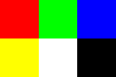

+++
title = "Format d'image PPM"
+++

# Format d'image PPM

Publié le 2 août 2021 par Aur36 sous licence CC BY-SA 4.0.

## Énoncé

Le format PPM est un format d'image extrêmement simple, proche du bitmap : il
suffit d'indiquer `P3` en entête, puis sur une autre ligne le nombre de colonnes
et de lignes de l'image, sur une autre ligne la valeur maximale des couleurs
(généralement 255) et enfin chaque ligne suivante représentera un pixel, défini
par la valeur de ses trois couleurs RGB. Les pixels sont parcourus lignes par
lignes de l'image.

## Exemple

```
P3
# Par 3 colonnes et 2 lignes :
3 2
# Ayant 255 pour valeur maximale :
255
255 0 0
0 255 0
0 0 255
255 255 0
255 255 255
0 0 0
```

## Résultat



## Exercice

Implémentez un petit générateur d'images PPM en lignes de commande. Celui-ci
prendra en entrée la taille de l'image, une couleur de fond, puis un ensemble de
formes géométriques de votre choix (au format que vous voulez, vous pouvez par
exemple dire que `c 50 50 20 255 0 0` définit un carré de centre (50, 50), de
taille 20 et de couleur (255, 0, 0). Pour l'exercice, implémentez au moins les
carrés.
