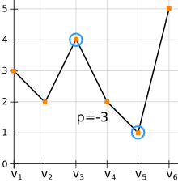

+++
title = "Pires investissements en bourse"
+++

# Pires investissements en bourse

Publié le 30 août 2021 par Aur36 sous licence CC BY-SA 4.0.

## Énoncé

Une entreprise spécialisée dans la finance réalise une étude sur les pires
investissements en bourse et souhaite s'équiper pour cela d'un programme. Ce
programme devra être capable d'analyser une série chronologique de valeurs
d’actions pour afficher la plus grande perte qu'il est possible de réaliser en
achetant une action à un instant t0 et en la revendant à une date ultérieure t1.
La perte sera exprimée par la différence de valeur entre t0 et t1. S'il n'y a
pas de perte, la perte vaudra alors 0.

## Entrée

Ligne 1 : le nombre `n` de valeurs en bourse disponibles.

Ligne 2 : les valeurs ordonnées depuis l'introduction en bourse `v1` jusqu'à la
dernière valeur connue `vn`. Les valeurs sont des entiers.

## Exercice

Codez un tel programme.

## Exemple

### Entrée

```
6
3 2 4 2 1 5
```

### Sortie

```
-3
```

### Illustration


