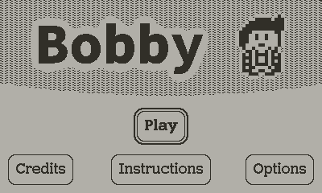
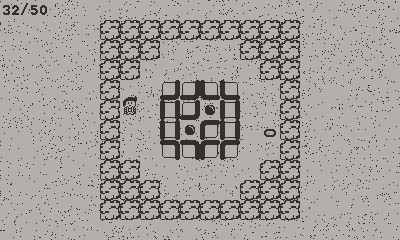
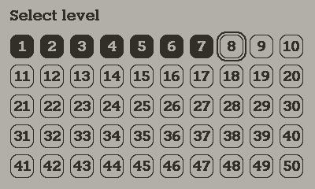
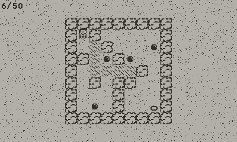
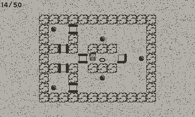
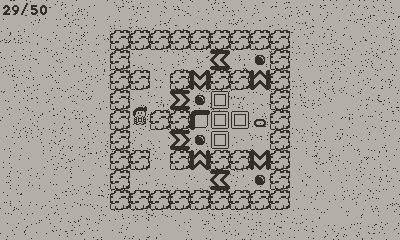
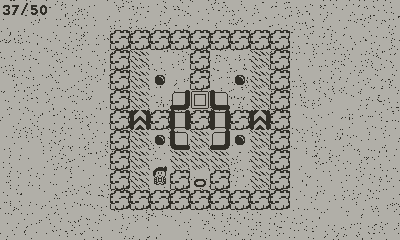

+++
title = "Bobby for Playdate"
+++

# Bobby for Playdate

Publié le 6 novembre 2022 sous licence AGPLv3.

- [Accéder à la fiche du jeu sur itch.io](https://yannicka.itch.io/bobby-playdate)
- [Visionner le code source](https://gitlab.com/yannicka/bobby-playdate)

## Description du jeu

Bobby for Playdate est une adaptation de mon jeu [Bobby](/projets/bobby) pour la console [Playdate](https://play.date/).

## Images

## Développement

J'ai recodé l'entièreté du jeu en Lua, avec le SDK de la Playdate. Le code de base (en TypeScript) étant assez simple, le portage n'a pas été très complexe à effectuer. J'ai néanmoins dû retravailler les graphismes (et quelques niveaux), de sorte à ce qu'ils s'affichent correctement sur un écran noir et blanc assez petit.
