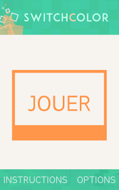

+++
title = "Switch Color"
+++

# Switch Color

Switch Color est mon premier jeu Android.

Le développement a commencé le 10 octobre 2013. Le jeu est sorti le 31 août 2014 sous licence AGPLv3.

- [Voir la fiche Google Play (Android)](https://play.google.com/store/apps/details?id=com.pifyz.switchcolor)
- [Visionner le code source](https://gitlab.com/yannicka/switch-color)

## Description

*Reprise depuis Google Play, écrite par un ami.*

« Réfléchissez pour vous débarrasser des tuiles de couleur !

Switch Color est un jeu au concept simple mais terriblement addictif.

Vous devez nettoyer des stages en faisant disparaître les tuiles de couleur qui les habitent : appuyez sur une tuile pour la nettoyer, mais les quatre tuiles adjacentes se verront également retournées !

- Réfléchissez et venez à bout de près de 80 stages ;
- Nettoyez un niveau avec le minimum d'actions pour débloquer des étoiles ;
- Relevez des défis aléatoires pour faire travailler vos méninges. »

## Images

## Accès direct

Initialement, Switch Color a été écrit en JavaScript et aurait dû être embarqué dans une vue navigateur *(webview)* dans une application Android. Mais j'ai finalement refait le jeu entièrement en Java, pour le défi de créer une application native et aussi afin d'avoir de meilleures performances.

L'ancienne version JavaScript du jeu est jouable, alors je l'inclus ici à titre historique.

<iframe
  src="src/index.html"
  loading="lazy"
  style="display: block; border: 2px solid #42c79c; width: 100%; max-width: 520px; height: 700px; margin-bottom: 2.5em;"></iframe>

## Anecdote

Pour l'anecdote, il s'agit d'une « copie » d'un jeu physique que j'ai eu dans mon enfance (au primaire, vers mes 9~10 ans). Le jeu proposait une grille de 5x5 où il fallait « nettoyer » les grilles, avec différentes difficultés, comme dans Switch Color.

Après avoir recherché (bien après avoir créé Switch Color), le nom du jeu d'origine est [Lights Out](https://fr.wikipedia.org/wiki/Lights_Out_(jeu)). Le jeu que je possédais était celui qu'on retrouve qu'on voit sur la page <https://www.xarg.org/2018/07/lightsout-solution-using-linear-algebra/> (je n'ai plus ce jeu en ma possession depuis un moment ; j'ai recréé le jeu de mémoire) :

